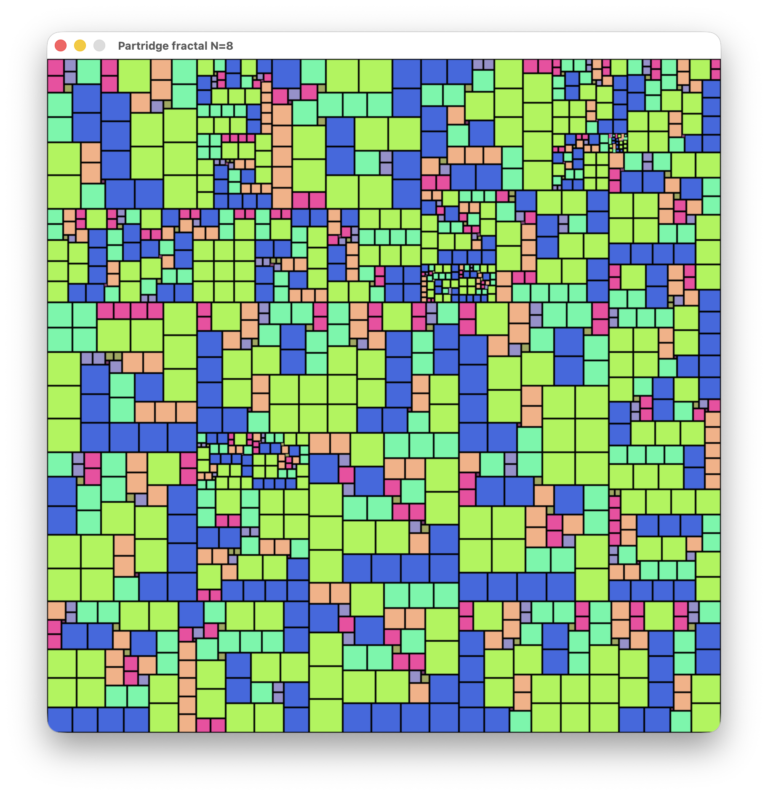

# partridge

View the [Partridge Puzzle](https://pyrigan.com/2017/02/17/the-partridge-puzzle/) as a fractal.
This puzzle is a tiling of one big square by many smaller square tiles; this code visualizes the fractal generated by recursively tiling the smaller squares.

Warning: the code is almost entirely AI-generated.

## Scripts

`solver.py`: generate solutions into `solutions.jsonl`; viewers use these solutions
`viewer_interactive.py`: display one solution, and click any tile to tile it and zoom in
`viewer_autozoom.py`: infinitely zoom in on recursive tilings
`viewer_fractal.py`: display two or more levels of the fractal at once
